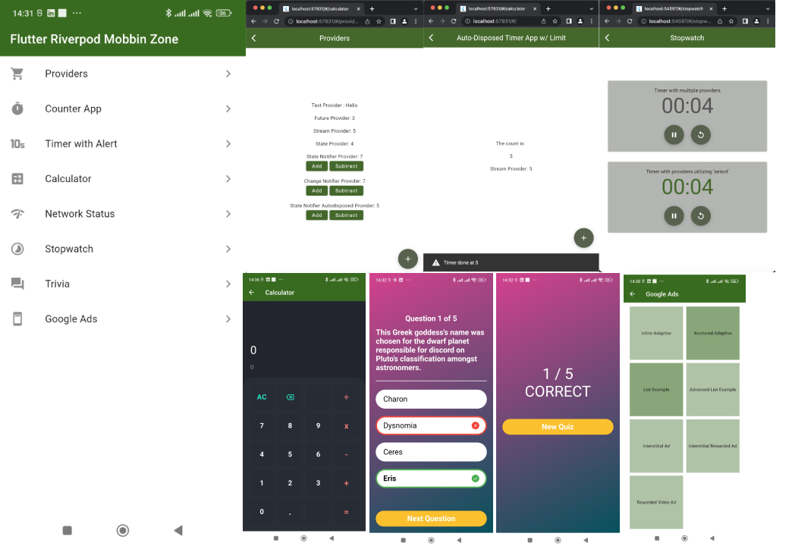
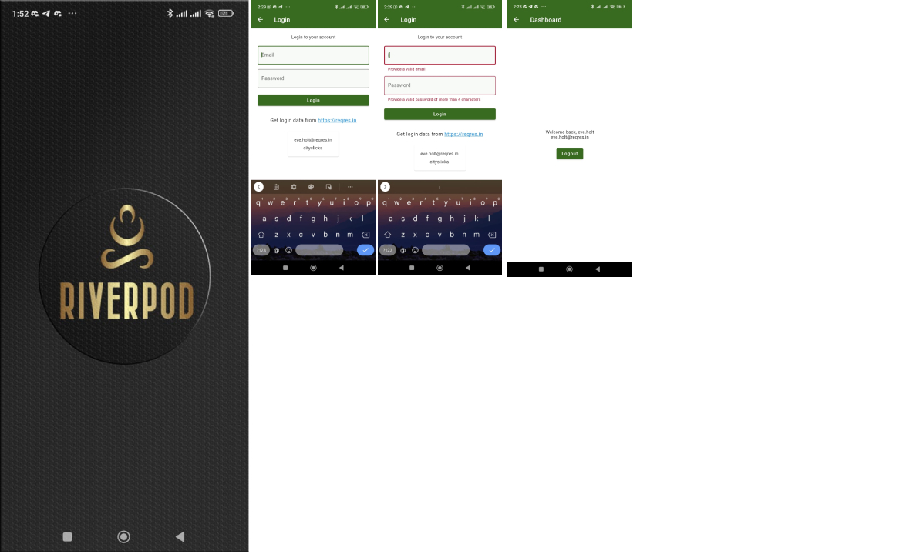
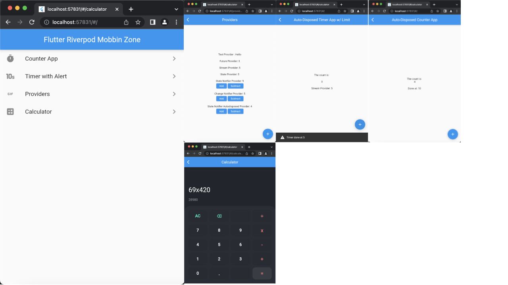

# Flutter Riverpod Learning/Reference zone

A Null-Safety flutter project acting as a learning/code reference zone

Based on
- Riverpod (v1/v2)
- Page Transitions
- Math Expressions
- Flex Color Scheme





### Resources
1. [App Structure by Code With Andrea](https://codewithandrea.com/articles/flutter-app-architecture-riverpod-introduction/)
2. [Feature-first or layer-first?](https://codewithandrea.com/articles/flutter-project-structure/)
3. [Riverpod Docs](https://riverpod.dev/docs/getting_started/)

## Getting Started

This project is a starting point for a Flutter application.

A few resources to get you started if this is your first Flutter project:

- [Lab: Write your first Flutter app](https://docs.flutter.dev/get-started/codelab)
- [Cookbook: Useful Flutter samples](https://docs.flutter.dev/cookbook)

For help getting started with Flutter development, view the
[online documentation](https://docs.flutter.dev/), which offers tutorials,
samples, guidance on mobile development, and a full API reference.

> NB: To view Google Ads, switch to the `googleads` branch as it does not work with the `web` version.

#### Launcher Icons
```bash
flutter pub run flutter_launcher_icons:main
```

#### Updating Splash Image
Using the `flutter_native_splash` package

```bash
flutter pub run flutter_native_splash:create
```


## Architecture/Project Structure
The base sturcture is based on **Code With Andrea's** app structure. It offers a sweet spot between **feature-first** and **Layer first** approach, which -honestly- makes a lot more sense. 

However, after building several prototypes (small quick apps), the structure feels augmented towards a *Bloc-like* architecture, where it begins to feel like there are too many files & folders for even the simplest of tasks.

The latest architecture features a *somewhat better and more flexible* architecture, offering a sweet spot between **feature-first**, **layer-first**, and **Code with Andreas's** architectures.

>NB: Check the real folder structure contained in this project for a better visual understanding.

Changes include:
- Renamed `presentation` -> `ui`: No need to name the `presentation` layer `presentation`. It's too lengthy and what we hate as devs is writing too much!
- Renamed `controllers` -> `providers`. We're dealing with providers after all, aren't we?
- Renamed `services` -> `repositories`. However, if you prefer naming yours services, well and good. The key point here is be **CONSISTENT** in your project. We will use **repositories** as it's the most popular convention.
- **StateNotifier** states(classes) moved from `providers` files to individual `models` folder.
- `enums` moved to `data`. For a **Clean architecture**, it would be better keeping all enums on their own and not in providers. It becomes easier to maintain the project in the long run.
- Merged `application`, `domain`, `controllers/providers` -> `data`. Any state has been separated from the `ui`. Any piece of state/logic has been moved out of the `presentation`/`ui` folder.
- Any form `TextEditingController` be used inside a `StatefulHookConsumerWidget` via `useTextEditingController`. **Riverpod Hooks** combined with **Flutter Hooks** are a fantastic way for handling such use-cases. Same goes for animations, pageControllers, e.t.c. found in the flutter hooks package. **Form Validation** can be done via the `validators` package, or for more complex validation, the *providers* can handle that (StateNotifiers) - Or however you deem fit :man_shrugging:
- Inside the `ui`, any **Screen** must be suffixed with `Screen` e.g. `OrdersScreen`. Any other widget should be viewed as a `partial/widget/fragment` to the main screen, and, therefore, can be re-used multiple times in the entire project - not just by the feature. Screens, on the other hand, **cannot** be re-used in other widgets.
- **Flexibility**: 
    - If a `feature` only requires a screen and a provider, the folder structure can then be:
        - ui 
        - providers
    - If a `feature` requires a screen, a provider, and a state/model/stateNotifier class, the folder structure can then be: 
        - ui
        - data
            - providers
            - models
    - If a `feature` requires a screen, a provider, a state/model/stateNotifier class, and enums, the folder structure can then be: 
        - ui
        - data
            - providers
            - models
            - enums
    - If a `feature` requires a screen, a provider, a state/model/stateNotifier class, enum, and repository, the folder structure can then be: 
        - ui
        - data
            - providers
            - models
            - enums
            - repositories
            - exceptions

For apps that have an **admin** and **user** dashboard, this architecture gets in line with the following architecture:
- main.dart
- src
    - app_routes.dart
    - common_widgets
    - utils
    - features
        - onboarding
        - splash
        - home
        - auth
        - admin
            - dashboard 
            - orders 
            - invoices
            - reports
        - user
            - dashboard
            - orders
            - cart
            - invoices

and each fature can then follow the guidelines above. The `ui` and `data` can now be tested individually.

>NB: Check the real folder structure contained in this project for a better visual understanding.

### Links
- [StopWatch](https://medium.com/flutter-community/flutter-riverpod-tutorial-timer-app-186d04637775)
- [Trivia](https://youtube.com/watch?v=H2uEIRNM7TE)

